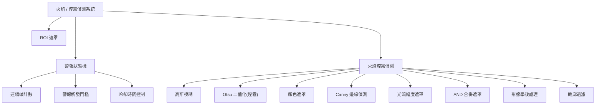
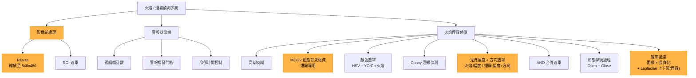
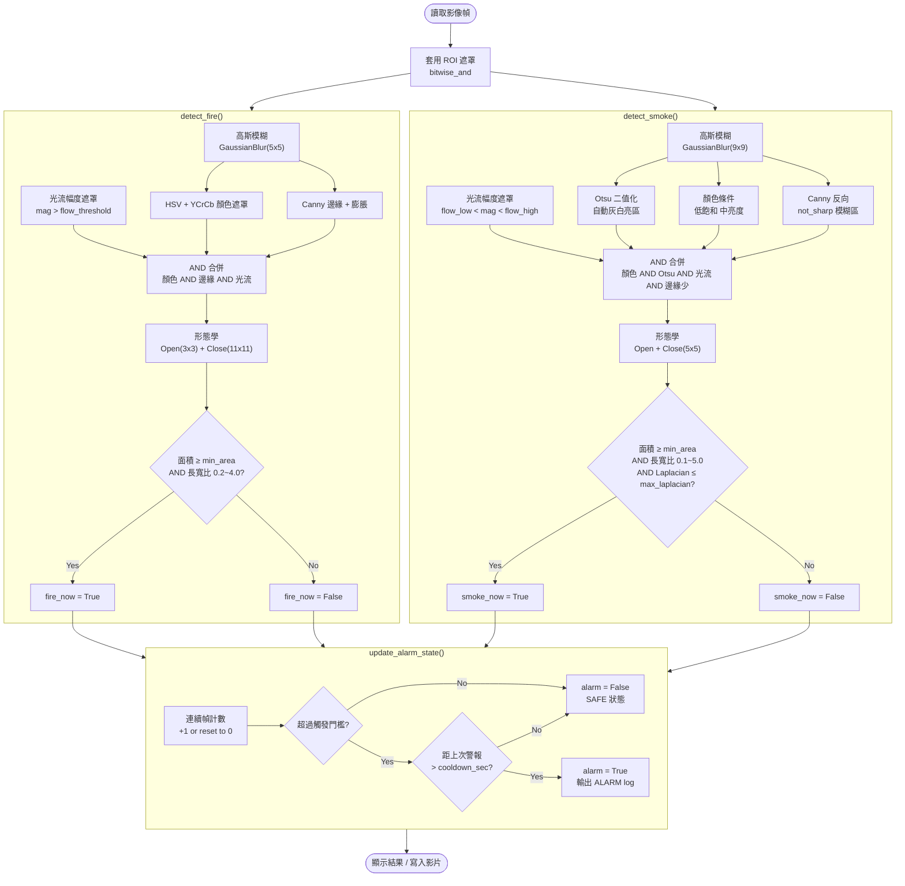
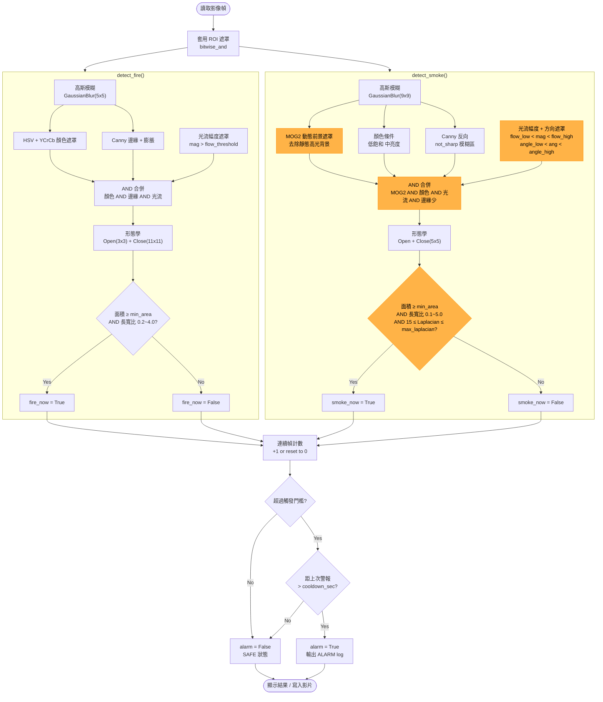

# Raspberry Pi 4 火焰／煙霧偵測專題

## 目錄

1. [需求](#需求)
2. [分析](#分析)
3. [設計](#設計)
4. [驗證計畫](#驗證計畫)
5. [參數調整](#參數調整)
6. [版本更新紀錄](#版本更新紀錄)---

## 需求

### 功能需求

| 項目 | 說明 |
|---|---|
| 輸入 | 影片檔案（`.mp4` 等）或即時相機串流 |
| 輸出 | 畫面上的火焰 / 煙霧 Bounding Box，並顯示警報狀態 |
| 警報機制 | 連續多幀偵測到後觸發警報，具冷卻時間避免重複警報 |
| 無頭模式 | 支援 `--no-display` 於無螢幕的 Raspberry Pi 上執行 |
| 影片輸出 | 可選擇將標註結果儲存為 `.mp4` |

### 規格需求

| 項目 | 規格 |
|---|---|
| 目標平台 | Raspberry Pi 4 或同級設備 |
| 解析度 | 640 × 480 |
| 目標幀率 | 15 FPS |
| 依賴套件 | `opencv-python`、`numpy` |
| 語言 | Python 3 |

### Bonus 目標

- 不同光影變化下仍能正確偵測（降低誤判）
- 效能優化，達到目標 FPS@resolution

---

## 分析

### breakdown
#### 舊版


#### 更新版


### 說明

### 🔥 火焰煙霧偵測模組

---

#### `cv2.GaussianBlur` — 高斯模糊

| | |
|---|---|
| **WHAT** | 使用高斯核對影像進行平滑化的影像濾波技術。 |
| **WHY** | 消除相機感測器雜訊與細微紋理，防止後續邊緣偵測或閾值化產生大量雜訊偽結果。 |
| **HOW** | 以 σ 參數定義的高斯分布為權重，對每個像素周圍鄰域進行加權平均，離中心的像素權重較低。 |

---

#### `cv2.threshold(OTSU)` — Otsu 二值化（煙霧）

| | |
|---|---|
| **WHAT** | 自動尋找最佳閾值，將灰階影像轉換為黑白二值影像的演算法。 |
| **WHY** | 煙霧呈灰白色，與背景有亮度差異；Otsu 法可自適應光照變化，無需手動設定閾值。 |
| **HOW** | 分析影像灰階直方圖，計算使「前景類別內變異數」最小（即「類間變異數」最大）的值，自動將煙霧區域從背景中分離。 |

---

#### `cv2.inRange` — 顏色遮罩（火焰）

| | |
|---|---|
| **WHAT** | 在 HSV 色彩空間中圈定火焰顏色範圍（紅、橙、黃），提取符合顏色的像素區域。 |
| **WHY** | 火焰具有獨特的暖色調特徵；在 HSV 空間中顏色範圍對光照變化更穩健，比 RGB 空間更容易分割。 |
| **HOW** | 將 BGR 影像轉換為 HSV；設定火焰色調（H）、飽和度（S）、明度（V）的上下界，對超出範圍的像素設為 0，形成二值遮罩。 |

---

#### `cv2.Canny` — Canny 邊緣偵測

| | |
|---|---|
| **WHAT** | 多階段邊緣偵測演算法，可找出影像中的精確邊界輪廓。 |
| **WHY** | 火焰輪廓具有不規則快速跳動的邊緣特徵；邊緣資訊可輔助排除靜態背景，強化動態目標偵測。 |
| **HOW** | ① 高斯平滑 → ② Sobel 梯度計算（強度與方向）→ ③ 非極大值抑制（細化邊緣）→ ④ 雙閾值（高/低）篩選 → ⑤ 邊緣連接，輸出細線邊緣圖。 |

---

#### `cv2.calcOpticalFlowFarneback` — 光流幅度遮罩

| | |
|---|---|
| **WHAT** | 計算連續幀之間像素運動量，提取高動態區域的遮罩。 |
| **WHY** | 火焰與煙霧具有持續性動態特徵；光流可過濾靜止物體（如燈光反射），降低靜態誤報。 |
| **HOW** | 使用 Farneback 光流演算法估算兩幀間各像素的位移向量，計算向量幅度，設定最小幅度閾值生成動態遮罩。 |

---

#### `cv2.bitwise_and` — AND 合併遮罩

| | |
|---|---|
| **WHAT** | 對多個偵測遮罩（顏色、邊緣、光流等）進行逐像素 AND 布林運算。 |
| **WHY** | 單一特徵容易產生誤報；AND 運算要求像素同時滿足多個條件，大幅提高偵測精確度。 |
| **HOW** | 對各遮罩進行逐像素邏輯 AND（`cv2.bitwise_and`），只有在所有輸入遮罩中均為白色（255）的像素，輸出遮罩才保留，其餘清零。 |

---

#### `cv2.morphologyEx` — 形態學後處理

| | |
|---|---|
| **WHAT** | 利用結構元素對二值影像進行侵蝕（erosion）與膨脹（dilation）等形態學操作。 |
| **WHY** | AND 遮罩後往往殘留零散離散雜訊小點；形態學操作可填補孔洞、去除雜點，使目標區域輪廓更完整。 |
| **HOW** | 先做侵蝕（縮小區域、去除小雜訊）再做膨脹（還原並填補目標主體），即「開運算」（Opening）；或反向操作填補孔洞（閉運算 Closing）。 |

---

#### `cv2.findContours` — 輪廓過濾

| | |
|---|---|
| **WHAT** | 從二值遮罩中提取連通區域輪廓，並依面積、長寬比等特徵篩選有效目標。 |
| **WHY** | 形態學後仍可能殘留小雜訊區塊；透過面積下界、形狀特徵可排除非火焰/煙霧的偽陽性區域。 |
| **HOW** | 呼叫 `cv2.findContours` 取得所有連通區域；計算每個輪廓面積、邊界長寬比、圓形度等特徵，過濾不符合火焰或煙霧幾何特徵的區域，輸出最終偵測邊界框。 |


## 設計

### 環境圖（Context Diagram）


### 偵測流程

#### 舊版


#### 更新版



### 警報狀態機（FSM）


| 狀態 | 說明 |
|---|---|
| `SAFE` | 未偵測到火焰或煙霧 |
| `FIRE ALARM` | 連續 ≥ 4 幀偵測到火焰 |
| `SMOKE ALARM` | 連續 ≥ 12 幀偵測到煙霧 |

### 核心 API（模組介面）

| 方法 | 輸入 | 輸出 |
|---|---|---|
| `detect_fire(frame_bgr)` | BGR 影像幀 | `(is_fire, mask, contours, area)` |
| `detect_smoke(frame_bgr)` | BGR 影像幀 | `(is_smoke, mask, contours, area, blur)` |
| `update_alarm_state(fire, smoke)` | 當前幀偵測結果 | `(alarm, fire_alarm, smoke_alarm)` |

---

### config.json 參數說明

```jsonc
{
  "camera": {
    "width": 640,
    "height": 480,
    "fps": 15,
    "frame_skip": 2,
    "roi": [0, 0, 640, 350]
  },
  "fire": {
    "hsv_lower1/upper1": "紅橘色 HSV 範圍（低段 Hue 0~35）",
    "hsv_lower2/upper2": "紅色 HSV 範圍（高段 Hue 160~179，處理 Hue 環繞）",
    "min_y":          "YCrCb 最低亮度（低於此值排除暗區）",
    "min_cr":         "最低紅色分量（低於此值排除非火焰色）",
    "max_cb":         "最高藍色分量（高於此值排除偏藍區域）",
    "min_area":       "最小有效輪廓面積（像素²，低於此值視為雜訊）",
    "canny_low":      "Canny 邊緣偵測下門檻（火焰邊緣明顯，建議 50）",
    "canny_high":     "Canny 邊緣偵測上門檻（建議 150）",
    "flow_threshold": "光流幅度門檻（超過才視為有移動，建議 15）"
  },
  "smoke": {
    "max_saturation":    "煙霧最大飽和度（煙霧為灰白低飽和，建議 100）",
    "min_value":         "灰白亮度下限（低於此值為過暗，排除）",
    "max_value":         "灰白亮度上限（高於此值為過亮，排除）",
    "min_area":          "最小有效輪廓面積（像素²，低於此值視為雜訊）",
    "max_laplacian_var": "最大銳利度（超過代表邊緣太清晰，非煙霧）",
    "canny_low":         "Canny 邊緣偵測下門檻（煙霧邊界模糊，建議 30）",
    "canny_high":        "Canny 邊緣偵測上門檻（建議 80）",
    "flow_low":          "光流幅度下限（低於此值為靜止物體，排除）",
    "flow_high":         "光流幅度上限（高於此值移動太快，非煙霧，排除）"
  },
  "motion": {
    "history":       "MOG2 背景學習幀數（越大背景越穩定）",
    "var_threshold": "MOG2 前景判斷門檻（越大越不敏感，建議 100）"
  },
  "alarm": {
    "fire_consecutive_frames":  "觸發火焰警報所需連續幀數（越小反應越快）",
    "smoke_consecutive_frames": "觸發煙霧警報所需連續幀數（煙霧較慢需較多幀）",
    "cooldown_sec":             "兩次警報間的最短間隔（秒，避免重複警報）"
  }
}
```

---

## 驗證計畫

| 測試項目 | 測試方法 | 預期結果 |
|---|---|---|
| 相機開啟 | `python main.py --source 0` | 可看到即時畫面 |
| 火焰偵測 | 使用安全測試影片或小範圍火焰影片 | 顯示 `FIRE ALARM` |
| 煙霧偵測 | 使用煙霧測試影片 | 顯示 `SMOKE ALARM` |
| 燈光誤判 | 手電筒、日光燈、螢幕亮光 | **不應**連續觸發警報 |
| 白色物體誤判 | 白紙、白牆移動 | **不應**觸發煙霧警報 |
| 低效能測試 | Raspberry Pi 4B 執行 640×480 @ 15 FPS | 可穩定執行 |
| 長時間測試 | 連續執行 30 分鐘 | 不當機、警報冷卻正常 |

---


## 參數調整

| 問題 | 調整方式 |
|---|---|
| 火焰太敏感（誤報多） | 提高 `fire.min_area` 或 `fire.min_cr` 或 `fire.flow_threshold` |
| 火焰偵測不到 | 降低 `fire.min_area` 或 `fire.min_y` 或 `fire.flow_threshold` |
| 火焰邊緣抓不到 | 降低 `fire.canny_low` 或 `fire.canny_high` |
| 火焰邊緣雜訊太多 | 提高 `fire.canny_low` 過濾弱邊緣 |
| 火焰輪廓破碎不完整 | 高斯模糊核心已固定 5x5，可提高 `fire.min_area` 讓小碎塊被忽略 |
| 靜止橘色物體誤判為火焰 | 提高 `fire.flow_threshold` 要求更明顯的移動 |
| 快速移動物體誤判為火焰 | 降低 `fire.flow_threshold` 縮小通過範圍 |
| 煙霧太敏感（誤報多） | 提高 `smoke.min_area` 或降低 `smoke.max_laplacian_var` 或縮小 `smoke.flow_high` |
| 煙霧偵測不到 | 降低 `smoke.min_area` 或提高 `smoke.max_saturation` 或提高 `smoke.flow_high` |
| 煙霧邊界太銳利誤判 | 降低 `smoke.canny_high` 讓更多區域被視為模糊 |
| 靜止白色物體誤判為煙霧 | 提高 `smoke.flow_low` 排除移動太慢的區域 |
| 快速移動物體誤判為煙霧 | 降低 `smoke.flow_high` 排除移動太快的區域 |
| 煙霧輪廓太碎 | 高斯模糊核心已固定 9x9，可降低 `smoke.min_area` 允許較小區塊合併 |
| 暗色煙霧偵測不到 | 降低 `smoke.min_value` 放寬亮度下限 |
| 過亮區域誤判為煙霧 | 降低 `smoke.max_value` 排除太亮的區域 |
| 光線變化造成背景誤判 | 提高 `motion.var_threshold` 讓 MOG2 更不敏感 |
| 警報太頻繁 | 提高 `alarm.cooldown_sec` |
| 警報反應太慢 | 降低 `alarm.fire_consecutive_frames` 或 `alarm.smoke_consecutive_frames` |

## 版本更新紀錄

### v2 煙霧偵測優化（改善過曝背景誤判）

針對「過度曝光的白色／灰色背景容易被誤判成煙霧」問題，進行以下五項改動：

---

#### 1. 啟用 MOG2 動態背景相減

| | |
|---|---|
| **原本狀況** | `__init__` 中宣告了 MOG2 背景相減器，但在偵測邏輯裡完全沒用到。 |
| **更新內容** | 將 MOG2 實裝進 `detect_smoke()` 中。 |
| **效果** | 過度曝光的窗戶或牆面通常是**靜止**的，MOG2 會直接把這些不動的亮區判斷為背景並剔除。 |

---

#### 2. 光流法升級：加入「方向性」判定

| | |
|---|---|
| **原本狀況** | 光流只計算物件「移動的幅度（Magnitude）」，只要有東西在動就可能觸發。 |
| **更新內容** | 將光流計算函式升級為 `_optical_flow_features()`，同時回傳移動幅度與**移動角度（Angle）**，並在煙霧判斷中加入角度遮罩。 |
| **效果** | 煙霧的物理特性是**向上飄散**。系統現在要求動態物件必須往上方移動（預設 210°～330° 之間）才會被判定為煙霧，大幅濾除雜訊。 |

---

#### 3. 捨棄 Otsu 全域二值化

| | |
|---|---|
| **原本狀況** | 使用 Otsu 二值化來抓取灰白區域，但 Otsu 的特性是會「強迫」將畫面中最亮的部分切分出來。 |
| **更新內容** | 完全移除 Otsu 二值化的步驟。 |
| **效果** | 避免系統在沒有煙霧的正常畫面中，硬生生把最亮的燈光或反光當作前景煙霧。 |

---

#### 4. 新增 Laplacian 模糊度「下限」

| | |
|---|---|
| **原本狀況** | 只有設定模糊度上限 `blur_val <= max_laplacian_var`。 |
| **更新內容** | 加入了下限條件，改為 `15 <= blur_val <= max_laplacian_var`。 |
| **效果** | 過度曝光的「純死白」區域，其 Laplacian 變異數會趨近於 0。加上下限（15）可以過濾掉這些純白區塊，確保偵測到的物件具備煙霧應有的微弱紋理。 |

---

#### 5. config.json 參數擴充

| 新增參數 | 預設值 | 說明 |
|---|---|---|
| `smoke.angle_low` | `210` | 光流方向下限（度），低於此值排除 |
| `smoke.angle_high` | `330` | 光流方向上限（度），高於此值排除 |

讓你不用改程式碼，就能根據實際場地環境調整煙霧飄動的角度限制（例如現場有冷氣風扇導致煙霧往側邊飄，可以從設定檔放寬角度）。

---

**優化後觸發煙霧警報需同時滿足：有在動、往上飄、顏色對、不是純白死光。**
